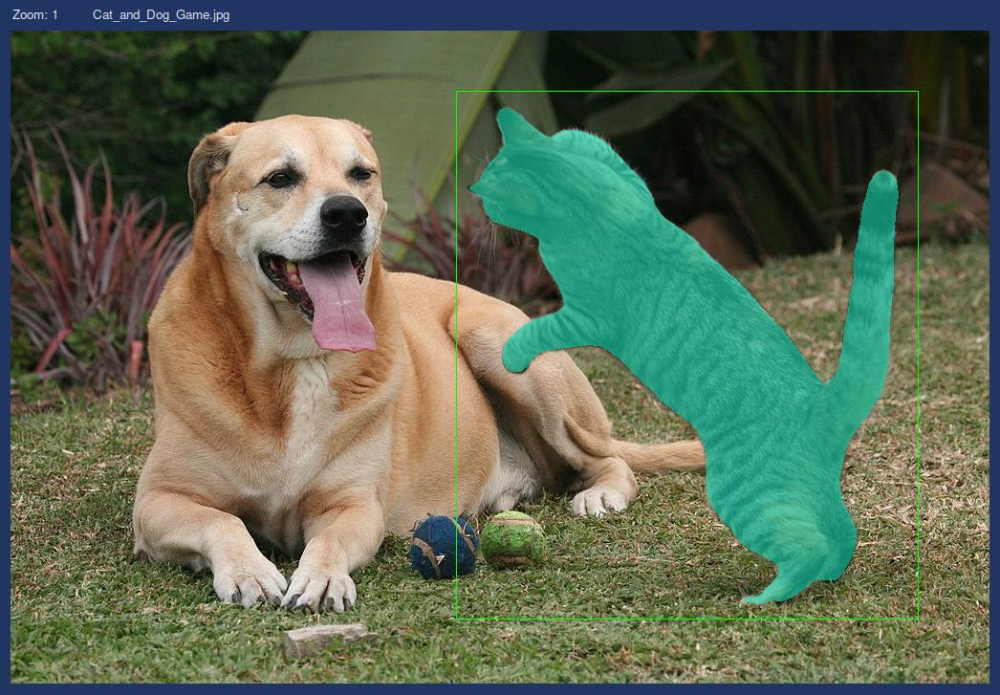

# SimpleSAM


# Introduction
Meta AI's [Segment Anything Model (SAM)](https://github.com/facebookresearch/segment-anything/) is an exciting foundational tool that became popular with the computer vision community the moment it was released.  Utilizing human supplied prompts (key points and bounding boxes), a large pretrained image transformer (ViT), and a lightweight mask decoder, SAM can do in less than a second what used to take minutes or hours by hand. A number of large annootation platforms such as [V7](https://www.v7labs.com/), [Label Studio](https://labelstud.io/), [roboflow](https://roboflow.com/), [cloudfactory](https://www.cloudfactory.com/), etc. have already added support for SAM, but these options may not fit AI shops with small budgets or those wishing to avoid web based tools.

SimpleSAM is an open-source, self-contained annotation tool you can install like any other Python package.  Key features include:
* an easy to use GUI
* integration with SAM using keypoints, bounding boxes, or combinations of both
* edit/create COCO formatted datasets
* pan/zoom, and pixel level editing

# Requirements
* An NVIDIA graphics card with cuda installed
* python >= 3.8

# Installation
1. Create a new python environment and install using pip
```bash
pip install simplesam
```
2. Download one of the pretrained models from [Meta AI's SAM repository](https://github.com/facebookresearch/segment-anything/).

# Usage
To launch the app just type `simplesam` in your terminal and hit enter.

## Loading an existing COCO Dataset
SimpleSAM utilizes the [COCO data format](https://cocodataset.org/#format-data), a popular choice for computer vision tasks.  The expected file structure is:
```bash
dataset_dir/
    data/
        filename0.ext
        filename1.ext
        ...
    labels.json
```
**Be sure the subfolder with images is labeled 'data' and your annotations file is labeled 'labels.json'.** SimpleSAM will complain it can't find your data if it's not.

When you have your file structure set up use the `Load` button to select your dataset directory.

## Creating a new COCO Dataset
To make a new dataset create the following file strucutre:
```bash
dataset_dir/
    data/
        filename0.ext
        filename1.ext
```
and populate the `data` directory with the images you want to annotate.

When you are ready use the `Load` button and select the dataset directory created in the previous step.  SimpleSAM will ask you if you want to create a new COCO dataset using images from the /data directory. Click Ok.

## Browsing your dataset


The Dataset section gives you direct access to your underlying COCO dataset.  Here you will see three lists.  Use the `Images` list to select an image for annotation. The `Annotations` list contains all of the objects labeled for a given image.  You can toggle the visibility of annotation masks using the checkbox next to the word 'Annotations'. There is also a `Remove` button below the Annotations list that you can use to remove any annotations you don't want. *CAUTION* SimpleSAM does not have an undo manager!  All changes are permanent.  The last list shows all of the categories currently present in your dataset.  If you are starting from scratch this list might be blank.  You can add or remove categories at will using the corresponding buttons below the list.

## Using SAM


To start using SAM click the `Load Checkpoint` button and select the model checkpoint file you downloaded during installation.  This may take a few seconds to load, so enjoy the cool spinning graphic while you wait.

## Prompting Tools
SAM offers three forms of prompts that can be used for segmentation: positive areas (things you want included), negative areas (things you want left out), and bounding boxes.  You can use any one or a combination of prompts to segment an object in an image.  

To add a positive area click the `+ Add area` radio button, move your mouse over an area of interest and click.  After a brief pause you shold see a green dot along with a colored segmentation mask overlayed on your image.  In the 'Masks' list you will see three choices.  This is because SAM actually provides three mask predictions as output.  SimpleSAM selects the mask with the highest predicted quality for you by default, but feel free to use one of the others.  If there is an area in the segmentation you want left out you can use the `- Subtract area` radio button and click the area you want removed.  Areas marked for subtraction are colored red.


To use a bounding box as a prompt select the `BBox` radio button.  Click and drag over the region you wish to annotate.  Releasing the mouse will generate a new set of candidate masks just like the area propmpting tool.   


If at anytime you make a mistake or don't like the current annotation results, simply click the 'Reset' button to start over.

## Adding an annotation to your dataset
Once you have a mask that you want to add to your dataset click the `Add to dataset` button.  The new mask will be added to the dataset section under 'Annotations' and automatically highlighted and given an id.  To finish, select an appropriate category or add a new one if needed.

## Saving
SimpleSAM does not have undo management nor an automatic saving feature, so be sure to save often and especially before exiting the program!


# Acknowledgements
* Meta AI. Thanks for making such a powerful tool open-source
* [PySimpleGUI](https://www.pysimplegui.org) powers the UI of SimpleSAM.  Tip of my hat to the author for making a wonderful tool.
* All images from the 'Usage' section were obtained from the [Wikimedia Commons](https://commons.wikimedia.org/).  Thanks to the originating authors for sharing their photos.


| File | Author |
|----- | ------ |
| Cat_and_Dog_Game.jpg | Faypearse, CC BY-SA 4.0, via Wikimedia Commons |
| cat_sitting_down_on_the_branch_of_tree.jpg | KKPCW, CC BY-SA 4.0, via Wikimedia Commons |
| dalmation_puppies.jpg | Carlos Estrada, CC BY-SA 3.0, via Wikimedia Commons |

[CC BY-SA 4.0 license](https://creativecommons.org/licenses/by-sa/4.0)

[CC BY-SA 3.0 license](https://creativecommons.org/licenses/by-sa/3.0)

# License
SimpleSAM has a liberal MIT [license](LICENSE).  If you use SimpleSAM in a project or as part of published research a citation with a link back to this repo would be much appreciated.

