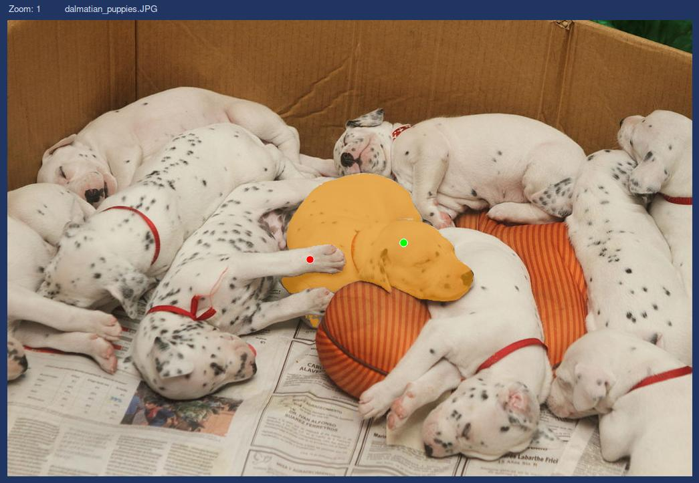

# SimpleSAM

SimpleSAM is a self-contained annotation tool based on Meta's Segment Anything Model (SAM).

# Requirements
* An NVIDIA graphics card with cuda installed
* python >= 3.8

# Installation
1. Create a new python environment and install using pip
```bash
pip install simplesam
```
2. Download one of the pretrained models from [Meta's SAM repository](https://github.com/facebookresearch/segment-anything/).

# Usage
To launch the app just type `simplesam` in your terminal and hit enter.

## Loading an existing COCO Dataset
SimpleSAM utilizes the [COCO data format](https://cocodataset.org/#format-data), a popular choice for computer vision tasks.  The expected file structure is:
```bash
<dataset_dir>/
    data/
        <filename0>.<ext>
        <filename1>.<ext>
        ...
    labels.json
```
*Be sure the subfolder with images is labeled 'data' and your annotations file is labeled labels.json.* SimpleSAM will complain it can't find your data if it's not.

When you are ready you can use the `Load` button to select your dataset directory.  If you get an error 

## Creating a new COCO Dataset
To make a new dataset create the following file strucutre:
```bash
<dataset_dir>/
    data/
        <filename0>.<ext>
        <filename1>.<ext>
```
and populate the `data` directory with the images you want to annotate.

When you are ready use the `Load` button and select the `data` folder containing your images.  SimpleSAM will ask you if you are sane..say I hope so.

## Browsing your dataset

## Using SAM


To start using SAM click the `Load Checkpoint` button and select the model checkpoint file you downloaded during installation.  This may take a few seconds to load, so enjoy the cool spinning graphic while you wait.

## Prompting Tools
SAM offers three forms of prompts that can be used for segmentation: positive areas (things you want included), negative areas (things you want left out), and bounding boxes.  You can use any one or a combination of prompts to segment an object in an image.  

To add a positive area click the `+ Add area` radio button, move your mouse over an area of interest and click.  After a brief pause you shold see a green dot along with a colored segmentation mask overlayed on your image.  In the 'Masks' list you will see three choices.  This is because SAM actually provides three mask predictions as output.  SimpleSAM selects the mask with the highest predicted quality for you by default, but feel free to use one of the others.  If there is an area in the segmentation you want left out you can use the `- Subtract area` radio button and click the area you want removed.  Areas marked for subtraction are colored red.



If at anytime you make a mistake or don't like the current annotation results, simply click the 'Reset' button to start over.

## Adding an annotation to your dataset

# Acknowledgements

# Resources
# Resources used for troubleshooting PySimpleGUI related tasks
# https://stackoverflow.com/questions/41656176/tkinter-canvas-zoom-move-pan
# https://github.com/PySimpleGUI/PySimpleGUI/issues/3054
# https://stackoverflow.com/questions/68069438/pysimplegui-tk-drawing-opencv-image-into-sg-graph-efficiently