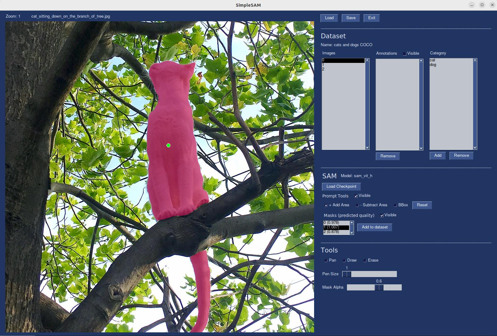

# SimpleSAM

SimpleSAM is a self-contained annotation tool based on Meta's Segment Anything Model (SAM).  

# Requirements
* An NVIDIA graphics card with cuda installed
* python >= 3.8

# Installation
To install SimpleSAM create a new python environment and install using pip
```bash
pip install simplesam
```
You will also need one of the pretrained models from [Meta's SAM repository](https://github.com/facebookresearch/segment-anything/).

# Useage
## Starting SimpleSAM
SimpleSAM is installed both as a python library and command line tool.  To launch the app run
```bash
simplesam
```
from you terminal.

## Loading and creating COCO Datasets
SimpleSAM utilizes th

# Acknowledgements

# Resources
# Resources used for troubleshooting PySimpleGUI related tasks
# https://stackoverflow.com/questions/41656176/tkinter-canvas-zoom-move-pan
# https://github.com/PySimpleGUI/PySimpleGUI/issues/3054
# https://stackoverflow.com/questions/68069438/pysimplegui-tk-drawing-opencv-image-into-sg-graph-efficiently